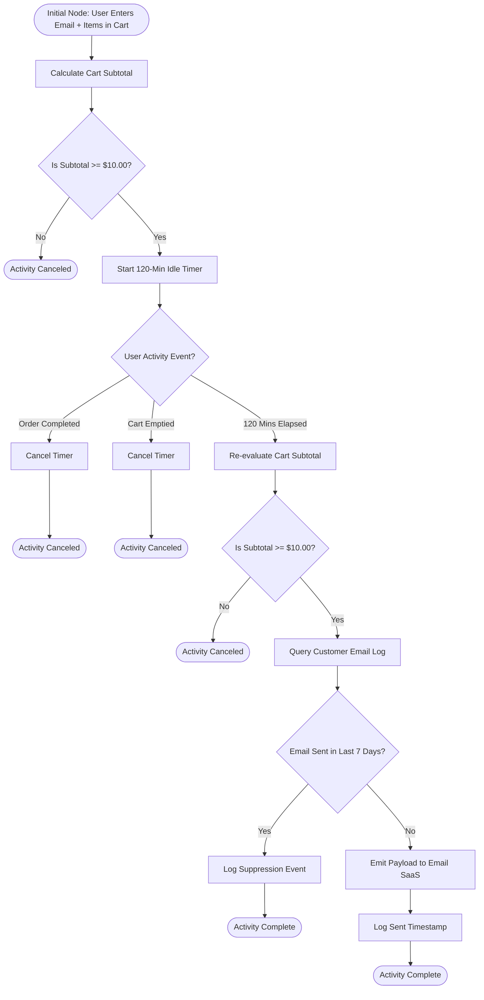

# E-Commerce Checkout & Retention Optimization | Business Analysis Case Study

An end-to-end business analysis case study and requirements specification document focused on reducing checkout cart abandonment and eliminating integration friction for an enterprise e-commerce platform.

---

## 1. Executive Summary & Strategic KPIs

An enterprise e-commerce platform experienced a **70% checkout cart abandonment rate**, leading to lost revenue and inflated acquisition costs. This case study details the functional requirements lifecycle designed to address this problem—tracing strategic business objectives down to business rules, process models, data flow boundaries, and sprint-ready user stories.

### Key Performance Indicators (KPIs)
* **Primary KPI 1:** Increase overall store checkout sales conversion by **20%**.
* **Primary KPI 2:** Recover **50%** of abandoned carts ($10.00+ subtotal) via automated re-engagement.
* **Primary KPI 3:** Protect checkout conversion from third-party API latency through automated fallback rules.

---

## 2. Comprehensive Business Rules

### BR-01: Cart Abandonment Engine & Frequency Suppression
* **Inactivity Trigger:** A cart session is flagged as abandoned after **120 consecutive minutes** of user inactivity following email entry.
* **Cart Subtotal Gate:** Requires a minimum cart subtotal of **$10.00** (excluding tax and shipping).
* **Post-Timer Re-evaluation:** The system must recalculate the cart subtotal at minute 120 *before* firing an external payload. If item removals dropped the cart below $10.00, the trigger cancels.
* **7-Day Suppression Cap:** If a recovery payload was emitted for that email address within the last **7 rolling days**, the payload is suppressed and logged internally.

### BR-02 & BR-02.1: Loyalty Point Earning, Redemption, & Provisional Holds
* **Point Valuation:** 100 points = $5.00 discount ($0.05 per point value).
* **Earning Schedule:** Earn 1 point per $1.00 spent. Points credit **24 hours post-shipment confirmation**.
* **Redemption Threshold:** Requires a minimum order subtotal of **$30.00** (applies to product subtotal only).
* **Provisional Lock (BR-02.1):** Redeeming points applies a **30-minute provisional database hold** to prevent double-spending across tabs. If the session expires or is abandoned, a background job restores points to the user's active balance.

### BR-03: Dynamic Shipping & API Fallback
* **3.0-Second Timeout Fallback:** The system enforces a strict **3.0-second timeout** on real-time carrier API lookups. If the API exceeds 3.0 seconds, the system automatically applies a **$5.99 flat-rate standard shipping fee**.
* **Silent Error Logging:** Fallback events write high-priority alerts to backend error tracking without displaying technical errors to the shopper. Late API payloads arriving after 3.0 seconds are discarded.

### BR-04: Guest Checkout & 1-Click Conversion
* **Frictionless Guest Checkout:** Guests complete purchases without password creation or mandatory account sign-up.
* **Post-Purchase Conversion:** An optional 1-click prompt on the order confirmation page allows shoppers to set a password and convert their guest profile into a registered account.

---

## 3. Visual System Models

### BR-01: Cart Abandonment & Suppression Logic (Activity Diagram)

