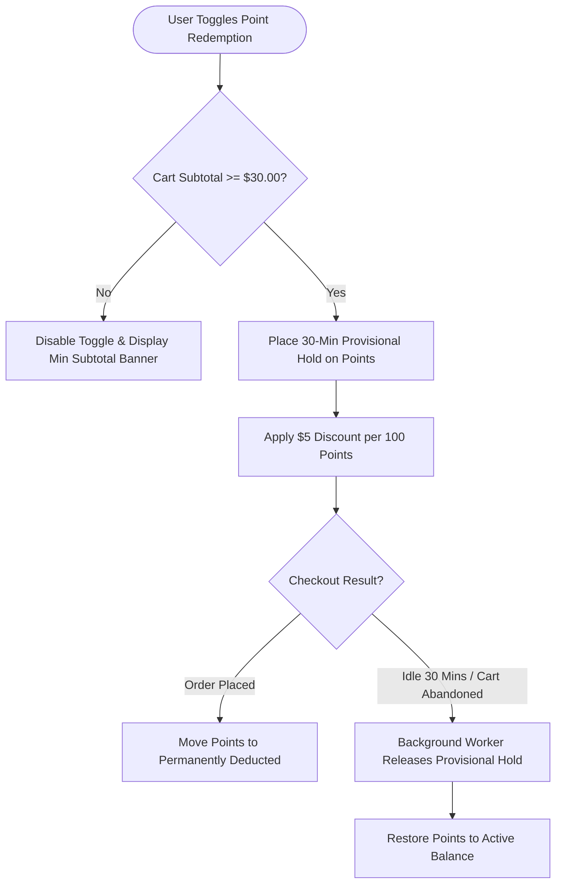

# BR-02: Loyalty Engine Flow

```mermaid
graph TD
    A([User Toggles Point Redemption]) --> B{Cart Subtotal >= $30.00?}
    B -- No --> C[Disable Toggle & Display Min Subtotal Banner]
    B -- Yes --> D[Place 30-Min Provisional Hold on Points]
    D --> E[Apply $5 Discount per 100 Points]
    E --> F{Checkout Result?}
    F -- Order Placed --> G[Move Points to Permanently Deducted]
    F -- Idle 30 Mins / Cart Abandoned --> H[Background Worker Releases Provisional Hold]
    H --> I[Restore Points to Active Balance]
```
