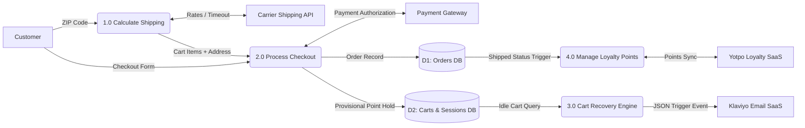

# BR-02: Data Flow diagram

```mermaid
graph LR
    Customer[Customer] -->|ZIP Code| P1(1.0 Calculate Shipping)
    P1 <-->|Rates / Timeout| Carrier[Carrier Shipping API]
    P1 -->|Cart Items + Address| P2(2.0 Process Checkout)
    Customer -->|Checkout Form| P2
    P2 <-->|Payment Authorization| Gateway[Payment Gateway]
    
    P2 -->|Order Record| DB1[(D1: Orders DB)]
    P2 -->|Provisional Point Hold| DB2[(D2: Carts & Sessions DB)]
    
    DB2 -->|Idle Cart Query| P3(3.0 Cart Recovery Engine)
    P3 -->|JSON Trigger Event| Klaviyo[Klaviyo Email SaaS]
    
    DB1 -->|Shipped Status Trigger| P4(4.0 Manage Loyalty Points)
    P4 <-->|Points Sync| Yotpo[Yotpo Loyalty SaaS]
```
