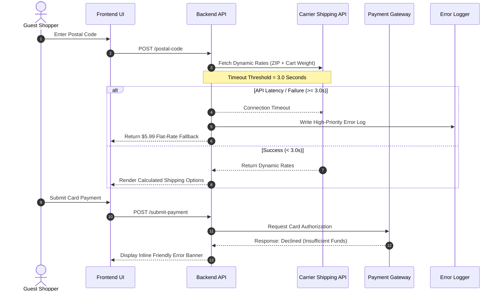

# BR-02: Checkout Sequence

```mermaid
sequenceDiagram
    autonumber
    actor Shopper as Guest Shopper
    participant UI as Frontend UI
    participant API as Backend API
    participant Carrier as Carrier Shipping API
    participant Gateway as Payment Gateway
    participant Logger as Error Logger

    Shopper->>UI: Enter Postal Code
    UI->>API: POST /postal-code
    API->>Carrier: Fetch Dynamic Rates (ZIP + Cart Weight)
    Note over API,Carrier: Timeout Threshold = 3.0 Seconds
    
    alt API Latency / Failure (>= 3.0s)
        API--xCarrier: Connection Timeout
        API->>Logger: Write High-Priority Error Log
        API-->>UI: Return $5.99 Flat-Rate Fallback
    else Success (< 3.0s)
        Carrier-->>API: Return Dynamic Rates
        API-->>UI: Render Calculated Shipping Options
    end
    
    Shopper->>UI: Submit Card Payment
    UI->>API: POST /submit-payment
    API->>Gateway: Request Card Authorization
    Gateway-->>API: Response: Declined (Insufficient Funds)
    API-->>UI: Display Inline Friendly Error Banner
```
